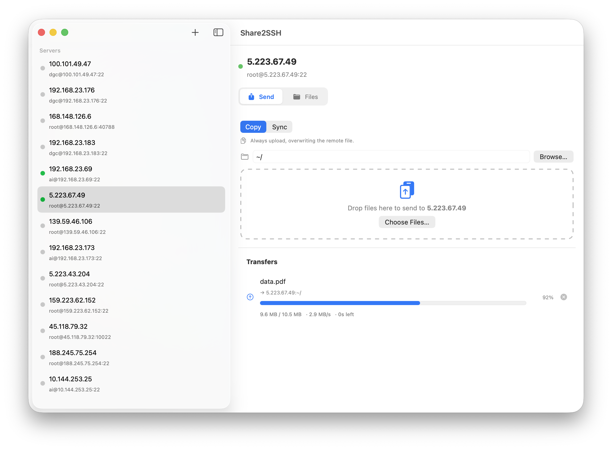

<div align="center">
	
	<h1>Share2SSH</h1>
	<p>Send files from your Mac to remote servers over SSH.</p>
</div>

Drag a file onto a server, or right-click it in Finder → **Share → Share2SSH**. It uses your existing `~/.ssh/config` and keys, and can browse the remote filesystem, sync, and download files back.



## Install

Grab the latest [release](https://github.com/seanghay/Share2SSH/releases/latest) and drag it to Applications. It's unsigned, so the first time, right-click → **Open**. Updates after that are automatic.

## Build

Open `Share2SSH.xcodeproj` in Xcode 26 and run, or:

```sh
xcodebuild -scheme Share2SSH -configuration Release build
```

## Notes

- Key-based auth only. "Sync" skips files already up to date (size + mtime), not an rsync delta.
- Pure-Swift SFTP via [Citadel](https://github.com/orlandos-nl/Citadel); auto-updates via [Sparkle](https://sparkle-project.org).

## License

MIT
